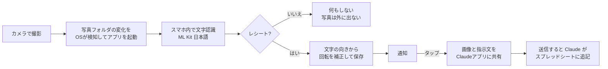

# レシートをClaudeへ (receipt-kakeibo)

レシートを撮るだけで、Claudeに家計簿へ記録してもらえるAndroidアプリです。

スマホで撮った写真をアプリが自動で確認し、レシートを見つけると向きを直して通知します。通知をタップすると、画像と指示文がClaudeアプリに渡され、送信するだけでClaudeがGoogleスプレッドシートの家計簿に品目ごとに追記します。

> スクリーンショット: (準備中)

## 使い方

1. [Releases](../../releases/tag/latest) から `receipt-kakeibo.apk` をダウンロードしてインストールする(初回のみ「提供元不明のアプリ」の許可が必要)
2. アプリを開き、写真と通知へのアクセスを許可する(写真は「すべて許可」)
3. 家計簿のGoogleスプレッドシートのURLをアプリに保存する
4. Claudeアプリで、チャットの「+」→ コネクタから Google Sheets をオンにしておく
5. 以降はレシートを撮影 → 通知をタップ → 送信

### 送り方は2種類

| 送り方 | 動き | 向いている使い方 |
| --- | --- | --- |
| スプレッドシートに追記(標準) | 画像と指示文を共有でClaudeアプリに渡す。毎回新しいチャットになり、Claudeがスプレッドシートに追記する | 家計簿をスプレッドシートで管理したい |
| 決めたチャットに貼り付け | 画像をコピーして、設定したチャットを開く。入力欄で貼り付けて送信する | 1つのチャットの中でClaudeに表を管理してもらいたい |

指示文はアプリ内で編集できます。指示文がClaudeアプリの入力欄に入らなかった場合に備えて、クリップボードにもコピーしています。

## 仕組み



### 工夫した点

- **常駐しない検知**: WorkManagerのコンテンツURIトリガーで「写真が増えたときだけ」OSに起こしてもらい、通知欄に常駐表示を出さずに動きます。取りこぼし対策として15分ごとの確認と、手動確認・過去24時間の再確認も用意しています。
- **写真を外に出さない判定**: レシートかどうかはスマホ内の文字認識(ML Kit)だけで判定します。「合計」「小計」「お買上」などの語、行末が金額で終わる行の数、適格請求書の登録番号などから判定し、迷ったら送らない側に倒しています。
- **左右の列を1行にまとめる**: レシートは商品名と金額が別々の行として認識されることがあるため、文字の位置から縦方向に重なる行を1行に組み直してから判定しています。
- **向きの自動補正**: EXIFの回転情報を反映したうえで、文字認識で水平に読める文字の量を比べ、横向き・逆さまで撮られた写真を正しい向きに直してから送ります。
- **規約の範囲で手間を最小に**: claude.aiを自動操作するのではなく、Androidの共有機能で公式のClaudeアプリに画像と指示文を渡すところまでをアプリが行い、送信は自分で行います。共有では毎回新しいチャットになるため、記録のルールと家計簿のURLを指示文として毎回添え、どのチャットからでも同じ形で追記されるようにしています。

## 技術スタック

- Kotlin / Jetpack Compose (Material 3)
- ML Kit Text Recognition v2(日本語・端末内処理)
- WorkManager(コンテンツURIトリガー + 定期実行)
- Room
- Claude アプリ + Google Sheets コネクタ(読み取りと追記)
- GitHub Actions(テスト・APKビルド・Releasesへの自動公開)

## 開発

```bash
./gradlew testDebugUnitTest   # レシート判定のユニットテスト
./gradlew assembleDebug       # APK のビルド
```

`app/debug.keystore` は、ビルドのたびに署名が変わって上書きインストールできなくなるのを防ぐための、個人利用向けの固定鍵です。ストア配布用ではありません。

このアプリはClaude(Anthropic)と対話しながら設計・実装しました。

## ライセンス

MIT
